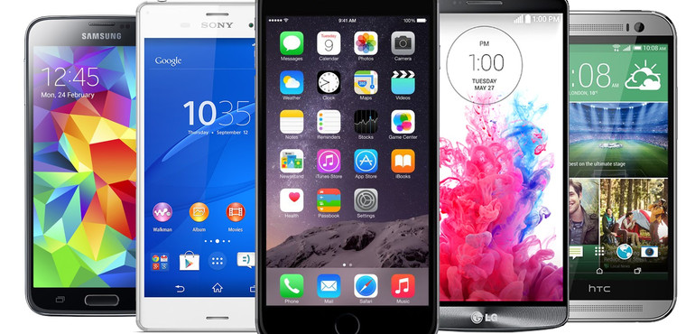

<div align="center">

</div>

<h1 dir="RTL"> 
تمرین سری دوم: تلفن همراه شناسی!
</h1>

> <p dir="RTL"> 
 با استفاده از داده های گوشی های همراه به سوالات زیر پاسخ دهید. 
برای رسم نمودار از پکیج 
ggplot2
استفاده کنید.
</p>

***

<p dir="RTL">
۱. کدام شرکت بیشترین تعداد گوشی را تولید کرده است؟
نمودار ستونی ۲۰ شرکت برتر بر حسب تعداد گوشی تولید کرده را رسم کنید.
</p>


```{r}
library(ggplot2)
library(dplyr)
library(readr)
mobile = read.csv("E:\\TahlilDade\\mobile_data.csv")
mobile %>% group_by(company) %>% summarise(num = sum(!is.na(device))) %>% arrange(desc(num)) %>% slice(1:20) -> comp
p = ggplot(comp, aes(x = reorder(company, num), y = num))
print(p + geom_col() + theme_classic() + theme(axis.text.x = element_text(angle = 90, hjust = 0)) + xlab("Company Name") + ylab("Product Number"))

```
***

<p dir="RTL">
۲. نمودار زمانی طول عرض  ضخامت و کیفیت دوربین گوشی ها را بکشید
 و به نمودار هر یک مدل خطی اضافه کنید.
</p>

```{r}
library(ggplot2)
library(readr)
library(ggthemes)
mobile = read.csv("E:\\TahlilDade\\mobile_data.csv")
mobile %>% group_by(year) %>% summarise(m_cam_px = mean(cam_px, na.rm = TRUE), m_dim_length = mean(dim_length, na.rm = TRUE), m_dim_breadth = mean(dim_breadth, na.rm = TRUE), m_dim_thickness = mean(dim_thickness, na.rm = TRUE))->stat
p = ggplot(data = stat, aes(x = year, y = m_cam_px))
coef = coef(lm(m_cam_px ~ year, data = stat))
print(p + geom_point() + geom_abline(intercept = coef[1], slope = coef[2]) + geom_line() + ggtitle("Camera Pixel over time") + xlab("Year") + ylab("Camera Pixel") + theme_bw())

p = ggplot(data = stat, aes(x = year, y = m_dim_length))
coef = coef(lm(m_dim_length ~ year, data = stat))
print(p + geom_point() + geom_abline(intercept = coef[1], slope = coef[2]) + geom_line() + ggtitle("Length over time") + xlab("Year") + ylab("Length") + theme_bw())

p = ggplot(data = stat, aes(x = year, y = m_dim_breadth))
coef = coef(lm(m_dim_breadth ~ year, data = stat))
print(p + geom_point() + geom_abline(intercept = coef[1], slope = coef[2]) + geom_line() + ggtitle("Breadth over time") + xlab("Year") + ylab("Breadth") + theme_bw())

p = ggplot(data = stat, aes(x = year, y = m_dim_thickness))
coef = coef(lm(m_dim_thickness ~ year, data = stat))
print(p + geom_point() + geom_abline(intercept = coef[1], slope = coef[2]) + geom_line() + ggtitle("Thickness over time") + xlab("Year") + ylab("Thickness") + theme_bw())
```


***

<p dir="RTL">
۳. نمودار ستونی متوسط قیمت گوشی بر حسب تعداد سیم کارت و دسترسی به 
LTE
را رسم نمایید.
</p>

```{r}
library(ggplot2)
library(readr)
library(dplyr)
library(ggthemes)
mobile = read.csv("E:\\TahlilDade\\mobile_data.csv")
mobile %>% group_by(LTE, sim_no) %>% summarise(m = mean(price, na.rm = TRUE)) -> stat
p = ggplot(data = stat, aes(x = sim_no, y = m, fill = LTE))
print(p + geom_col(position = 'dodge') + theme_bw() + xlab("SIM Card number") + ggtitle("Price over LTE and SIM Card number") + ylab("Average Price"))
```


***

<p dir="RTL">
۴. نمودار جعبه ایی ضحامت گوشی هایی که در سال ۲۰۱۷ معرفی شده اند را برحسب اینکه کمیت جک هدفون رسم نمایید
</p>
```{r}
library(ggplot2)
library(readr)
library(ggthemes)
mobile = read.csv("E:\\TahlilDade\\mobile_data.csv")
p = ggplot(data = mobile[which(mobile$year == 2017), ], aes(x = audio_jack, y = dim_thickness))
print(p + geom_boxplot() + theme_bw() + xlab("Has Audio Jack?") + ylab("Thickness"))
```


***

<p dir="RTL">
۵. مفهوم 
ppi 
را در گوشی های موبایل محاسبه و هیستوگرام آن را رسم نمایید.
همچنین نمودار سالانه متوسط این کمیت را بکشید.
کدام گوشی بیشترین
ppi
را دارد؟
</p>

```{r}
library(ggplot2)
library(readr)
library(dplyr)
library(ggthemes)
mobile = read.csv("E:\\TahlilDade\\mobile_data.csv")
mobile %>% mutate(ppi = (mobile$px_row**2 + mobile$px_col**2)**0.5 / mobile$display_size) ->mobile_ppi
p = ggplot(data = mobile_ppi, aes(x = ppi))
print(p + geom_histogram() + theme_bw() + ggtitle("ppi histogram"))
mobile_ppi %>% group_by(year) %>% summarise(m = mean(ppi, na.rm = TRUE)) ->stat
p = ggplot(data = stat, aes(x = year, y = m))
print(p + geom_point() + geom_line() + ggtitle("ppi over time") + xlab("Year") + theme_bw())
print("Max ppi:")
print(mobile_ppi[which(mobile_ppi$ppi == max(mobile_ppi$ppi, na.rm = TRUE)), ])
```


***

<p dir="RTL">
۶. در گذشته به بعضی از مدل های گوشی نوکیا 
**گوشکوب**
گفته می شد. سعی کنید برای این مفهوم کمیتی مناسب تعریف کنید .
 ده گوشکوب برتر را پیدا کرده و نمودار گوشکوبیت آن را رسم نمایید.
</p>

در گذشته علت این نام گزاری این بود که گوشیهای نوکیا بسیار محکم وبه اصطلاح جانسخت بودند.
با این وجود در دادههای ما هیچ داده ای وجود ندارد که با آن بتوان چچنین معیاری را حساب کرد پس به ناچار به شباهت ظاهری پناه بردیم و نسبت مشخصی را تعیین کردیم تا هرچه نسبت ضخامت و عرض بر روی طول به آن نزدیک تر بود آنرا بیشتر شبیه گوشکوب بیابیمو سپس گوشی های یافت شده را اسکیل کردیم.نسبت مضخص را با امتحان و خطا بدست آوردیم.

```{r}
library(ggplot2)
library(readr)
library(dplyr)
library(ggthemes)
mobile = read.csv("E:\\TahlilDade\\mobile_data.csv")
ideal <- 0.31
mobile %>% mutate(x =  ((dim_breadth * dim_thickness)**0.5 / dim_length)) %>%  arrange(desc(x)) %>% filter(x < ideal) %>% mutate(gooshkoobiat = x - 0.309) %>% slice(1:10) -> gooshkoob 

print(gooshkoob)
p = ggplot(data = gooshkoob, aes(x = reorder(device, gooshkoobiat), y = gooshkoobiat))
print(p + geom_col(aes(fill = company)) + xlab("Device")+ theme_bw() + theme(axis.text.x = element_text(angle = 90, hjust = 0)))
```

***

<p dir="RTL">
۷. آیا تلفن همراهی وجود دارد که در آب غرق نشود؟
اگر جواب بله هست تمام گوشی های که این خاصیت را دارند بیابید.
با کشیدن یک نمودار به این سوال پاسخ دهید.
</p>

```{r}
library(ggplot2)
library(readr)
library(dplyr)
library(ggthemes)
mobile = read.csv("E:\\TahlilDade\\mobile_data.csv")
mobile %>% mutate(dens = 1000 * weight / (dim_length * dim_breadth * dim_thickness)) ->stat
p = ggplot(data = stat, aes(dens, fill = ifelse(dens < 1, "red","blue")))
print(p + geom_histogram(binwidth = 0.01) + theme_bw() + xlab("Density"))
print("All this phones:")
stat %>% filter(dens < 1) %>% print()
```


***

<p dir="RTL">
۸. نمودار پراکنش حجم ذخیره سازی باطری و وزن را رسم نمایید.
میزان همبستگی بین این دو کمیت را محاسبه کنید.
</p>

```{r}
library(ggplot2)
library(readr)
library(dplyr)
library(ggthemes)
mobile = read.csv("E:\\TahlilDade\\mobile_data.csv")
p = ggplot(data = mobile, aes(x = battery_mah))
print(p + geom_density() + theme_bw() + ggtitle("Battery distribution") + xlab("Battery capacity"))
p = ggplot(data = mobile, aes(x = weight))
print(p + geom_density() + theme_bw() + ggtitle("Weigth distribution") + xlab("Weight"))
mobile = mobile[which(is.na(mobile$battery_mah) == FALSE & is.na(mobile$weight) == FALSE), ]
weight = mobile$weight
battery = mobile$battery_mah
print("Correlation is:")
print(cor(weight, battery))
```


***

<p dir="RTL">
۹. قیمت پرچمداران یک برند خاص مثلا سامسونگ را بیابید و نمودار قیمت زمان و نام مدل را رسم نمایید.
</p>

برا تشخیص پرچمداران به دو صورت عمل شد.یکی در ابتدا همه خصوصیات من جمله کیفیت دوربین و فیمت و کیفیت صفحه نمایش نرمال شدند (بر ماکسیمم همان سال و همان برند تقسیم شدند)
و سپس با هم جمع شده و بالاترین امتیاز به عنوان  پرچمدار انتخاب شد در این معیار با اینکه گوشی های بسیار خوبی به عنوان پرچمدار انتخاب شدند ولی این انتخاب با انتخاب سایت ها متفاوت بود فلذا صرفا قیمت های داده پرتشان را حذف کردیم و بالاترین قیمت را به عنوان پرچمدار اعلام کردیم.

```{r}
library(ggplot2)
library(readr)
library(dplyr)
library(ggthemes)
mobile = read.csv("E:\\TahlilDade\\mobile_data.csv")
mobile %>% mutate(ppi = (mobile$px_row**2 + mobile$px_col**2)**0.5 / mobile$display_size) ->mobile_ppi
mobile_ppi %>% filter(company == "Samsung") -> sam 
sam %>% group_by(year) %>% mutate(n_price = price/max(price, na.rm = TRUE), n_cam_px = cam_px/max(cam_px, na.rm = TRUE), n_sel_px = sel_px/max(sel_px, na.rm = TRUE), n_ram = ram/max(ram, na.rm = TRUE), n_ppi = ppi/max(ppi, na.rm = TRUE), n_battery_mah = battery_mah/max(battery_mah, na.rm = TRUE), score = n_price + n_cam_px + n_sel_px + n_ram + (LTE == "Yes") + (gps == "Yes") + (wlan == "Yes") + (nfc == "Yes") + n_ppi + n_battery_mah) ->flagship
#this is first approach which won't be use in future
sam %>% group_by(year) %>% filter(price < 2000) %>% mutate(score = price) ->flagship
#this is second approach
flagship %>% arrange(desc(score)) %>% slice(1) -> flagship
flagship %>% print()

p = ggplot(data = flagship, aes(x = year, y = price))
print(p + geom_point() + geom_line() + theme_bw())

```


***

<p dir="RTL">
۱۰. سه نمودار جالب رسم کنید و توضیح دهید چرا از نظر شما جالب است؟
</p>

نمودار اول:
در این نمودار می خواهیم ببینیم کدام یک از کمپانی ها بیشتر نسبت طلایی را در گوشیشان رعایت می کنند.

```{r}
library(ggplot2)
library(readr)
library(dplyr)
library(ggthemes)
mobile = read.csv("E:\\TahlilDade\\mobile_data.csv")
mobile %>% mutate(x =  aspect_row/ aspect_col)%>% group_by(company) %>% summarise(m = mean(x < 1.65 & x > 1.55 , na.rm = TRUE)) %>% arrange(desc(m)) %>% slice(1:20) ->company_n
company_n
p = ggplot(data = company_n, aes(x = reorder(company, m), y = m))
print(p + geom_col() + theme_bw() + theme(axis.text.x = element_text(angle = 90, hjust = 0)) + ylab("Percent") + xlab("Company"))
```


نمودار دوم:
در این نمودار می خواهیم ببینیم آیا اوجگیری دوربین های سلفی پس از اوج گیری اینستاگرام بود (در واقع علت آن بود)
 یا قبل از آن بود.
 
```{r}
library(ggplot2)
library(readr)
library(dplyr)
library(ggthemes)
mobile = read.csv("E:\\TahlilDade\\mobile_data.csv")
mobile %>% group_by(year) %>% summarise(m_sel_px = mean(sel_px, na.rm = TRUE)) -> selfie
p = ggplot(data = selfie, aes(x = year, y = m_sel_px))
print(p + geom_point() + theme_bw() + geom_line())
```
 که همانطور که مشاهده کردید این اوجگیری حدود ۱ سال پس از اوجگیری اینستاگرام بوده پس احتمالا گرایش مردم به اینستاگرام سبب رواج سلفی شده است.
 
 نمودار سوم:
 در این نمودار می خواهیم ببینیم بین کمپانی های مشهور و تکنولوژی های صفحه مشهور هر کمپانی به کدام یک گرایش بیشتری دارد.
 
```{r}
library(ggplot2)
library(readr)
library(dplyr)
library(ggthemes)
mobile = read.csv("E:\\TahlilDade\\mobile_data.csv")
mobile %>% group_by(company) %>% summarise(num = n()) %>% arrange(desc(num)) %>% slice(1:10) ->fam_company
mobile %>% group_by(display_tech) %>% summarise(num = n()) %>% arrange(desc(num)) %>% slice(1:10) ->fam_dis
mobile %>% filter(is.na(company) == FALSE & is.na(display_tech) == FALSE & is.element(company, fam_company$company) & is.element(display_tech, fam_dis$display_tech)) %>% group_by(company, display_tech) %>% summarise(count = n()) -> stat
print(ggplot(data = stat, aes(x = company, y = display_tech, fill = count)) + geom_tile() + theme_bw() + theme(axis.text.x = element_text(angle = 90, hjust = 0)))
```

