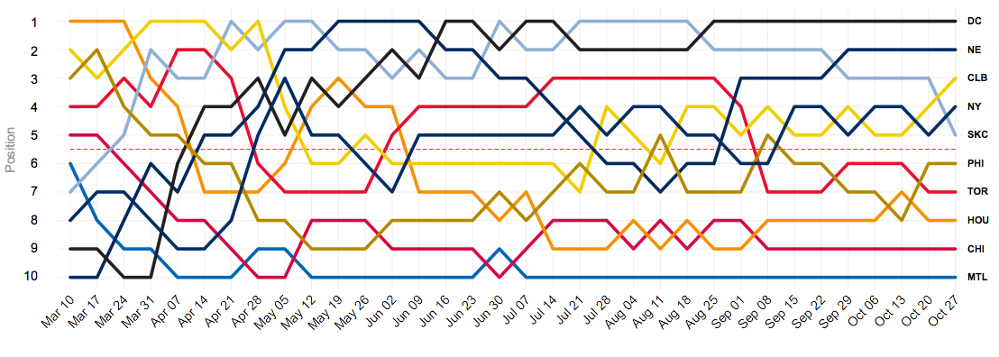

<div align="center">

</div>

<h1 dir="RTL"> 
تمرین سری سوم: از لالیگا تا لیگ برتر
</h1>

> <p dir="RTL"> 
با استفاده از داده های لیگ دسته اول اسپانیا به سوالات زیر پاسخ دهید.
از هر دو ابزار
ggplot2
و
highcharter
برای این کار تصویرسازی استفاده نمایید.
</p>

<p dir="RTL">
در کلیه سوالات فرض شده معیار قهرمانی ابتدا امتیاز سپس تفاضل گل و سپس گل زده است. برای کار کرد درست کد ها ابتدا قطعه کد زیر را اجرا کنید:
</p>
```{r}
library(engsoccerdata)
library(dplyr)
library(highcharter)
library(ggplot2)
library(ggthemes)
spn = as.tbl(spain)
rbind(spn %>% select(Season, tier, Date, team = home, opp = visitor, GF = hgoal, GA = vgoal),
      spn %>% select(Season, tier, Date, team = visitor, opp = home, GF = vgoal, GA = hgoal)
) %>% mutate(GD = GF - GA, point = 3* (GD > 0) + (GD == 0)) %>% group_by(Season, tier, team) %>% mutate(week_no = row_number(Date), rem_week = n() - week_no) %>% arrange(week_no) %>% mutate(cum_score = cumsum(point), cum_GD = cumsum(GD), cum_GF = cumsum(GF), cum_GA = cumsum(GA), Win = cumsum(GD > 0), Draw = cumsum(GD == 0), Lose = cumsum(GD < 0)) %>% group_by(Season, tier, week_no) %>% mutate(rank = n() + 1 - rank(order(order(cum_score, cum_GD)), ties.method = 'first')) -> full_info

full_info %>% group_by(Season, tier, team) %>% arrange(desc(week_no)) %>% slice(1) -> finals

finals %>% group_by(Season, tier) %>% arrange(rank) %>% slice(1) %>% filter(tier == 1) %>%  select(team, Season, score = cum_score) -> champ

champ %>% group_by(team) %>% summarise(num = n()) %>% arrange(desc(num)) -> num_champ
#View(num_champ)

full_info %>% filter(week_no == rem_week) %>% group_by(Season, tier) %>% arrange(rank) %>% slice(1) %>% filter(tier == 1) %>%  select(team, Season, score = cum_score) -> half_champ
```


***

<p dir="RTL">
۱. تعداد قهرمانی های تیم ها در تاریخ لالیگا  را استخراج کرده و نمودار ستونی آنها را رسم کنید.
</p>

```{r}
num_champ %>% hchart(type = "bar", hcaes(x = team, y = num)) %>% hc_add_theme(hc_theme_darkunica())
p = ggplot(data = num_champ, aes(x = reorder(team, num), y = num))
print(p + geom_col() + theme_bw() + theme(axis.text.x = element_text(angle = 90, hjust = 0)) + xlab("team name") + ylab("championship number"))

```


***

<p dir="RTL">
۲. کسل کننده ترین لیگ و تیم را بیابید.
نمودار ده تیم و ده فصل کسل کننده را رسم کنید.
</p>

```{r}
finals %>% group_by(team) %>% summarise(tot_G = (sum(cum_GA) + sum(cum_GF)) / sum(week_no)) %>% arrange(tot_G)%>% slice(1:10) -> stat
stat %>% hchart(type = "bar", hcaes(x = team, y = tot_G))
ggplot(data = stat, aes(x = reorder(team, tot_G), y = tot_G)) + geom_col() + theme_bw() + theme(axis.text.x = element_text(angle = 90, hjust = 0)) + xlab("team name") + ylab("amazingness")

finals %>% group_by(Season) %>% summarise(num_D = 2 * sum(Draw) / sum(week_no)) %>% arrange(desc(num_D)) %>% slice(1:10) -> stat
stat %>% hchart(type = "column", hcaes(x = as.character(Season), y = num_D))
ggplot(data = stat, aes(x = reorder(as.character(Season), num_D), y = num_D)) + geom_col() + theme_bw() + theme(axis.text.x = element_text(angle = 90, hjust = 0)) + xlab("team name") + ylab("boringness")

```


***

<p dir="RTL">
۳. در چند درصد موارد قهرمان نیم فصل در پایان فصل قهرمان شده است؟
</p>

```{r}
half_champ %>% select(Season, team1 = team) -> nim
champ %>% select(Season, team) %>% full_join(nim) %>% group_by(tier) -> stat
print(sum(stat$team == stat$team1) / count(stat))

```


***

<p dir="RTL">
۴. در بین سال های ۲۰۰۱ تا ۲۰۱۰ گربه سیاه تیم های بزرگ چه تیم هایی بوده است؟
</p>

<p dir="RTL">
برای این سوال ابتدا چند تیم قوی را انتخاب کرده و سپس از بین تیم های ضعیف آن تیم هایی را انتخاب می کنیم که این تیم ها را زیاد برده اند.
</p>

```{r}
full_info %>%  filter(Season >= 2001 & Season <= 2010) -> full_info_01_10
full_info_01_10 %>% filter(rem_week == 0) %>% group_by(team) %>% summarise(total_score = sum(cum_score)) %>% arrange(desc(total_score)) -> total
total %>% slice(1:4) %>% select(team) -> big_team
total %>% arrange(total_score) %>% slice(1:10) -> weak_team
big_team
weak_team
full_info_01_10 %>% filter(is.element(team, weak_team$team) & is.element(opp, big_team$team)) %>% group_by(team) %>% summarise(per_win = sum(GD > 0 ) / n()) %>% arrange(desc(per_win))

```


***

<p dir="RTL">
۵. در تاریخ لالیگا کدام تیم رکورددار زودترین قهرمانی است؟
همچنین کدام تیم مقتدرانه ترین قهرمانی را داشته است؟
</p>

```{r}
full_info  %>%  group_by(rank) %>% filter(rank == 1 || rank == 2) %>% group_by(Season, tier, rem_week) %>% arrange(rank) %>% summarise(t1 = max(cum_score) - min(cum_score)) %>% ungroup() %>% filter(t1 > 3 * rem_week) %>% arrange(desc(rem_week))
finals
finals %>% group_by(rank) %>% filter(rank == 1 || rank == 2) %>% group_by(Season, tier) %>% summarise(diff_score = max(cum_score) - min(cum_score)) %>% ungroup() %>% arrange(desc(diff_score)) %>% slice(1)

```


***

<p dir="RTL">
۶. طولانی ترین نوار پیروزی مساوی و شکست مال چه تیم هایی است؟
</p>

<p dir="RTL">
برای این سوال در ابتدا در هر فصصل جستجو کردیم سپس در کل
</p>

```{r}
#max_s <- 0
#shaak_team <- NA
#full_info %>% ungroup() %>% mutate(is_ok = (GD > 0)) %>% arrange(Date) %>% select(Season, team, week_no, is_ok) %>% group_by(Season, team) %>% arrange(week_no) -> full_info_6
#full_info_6$Season %>% unique() -> seasons
#for(season in seasons){
#  print(season)
#  full_info_6 %>% filter(Season == season) %>% .$team %>% unique() -> teams
#  for(tteam in teams){
#    print(tteam)
#    curr_s <- 0
#    m = max(full_info_6 %>% filter(Season == season & team == tteam) %>% .$week_no)
#    xx = full_info_6 %>% filter(Season == season & team == tteam)
#    for(i in 1:m){
      #print(i)
#      xx %>% filter(week_no == i) -> x
      #print(x)
#      if(x[1,]$is_ok){
#        curr_s <- curr_s + 1
#      }else{
#        curr_s <- 0
#      }
#      if(curr_s > max_s){
#        max_s <- curr_s
#        shaak_team = tteam
#      }
#    }
#  }
#}
#print(shaak_team + " has " + as.character(max_s) + " victories")
#View(full_info_6)
#first approach


max_s <- 0
shaak_team <- NA
full_info %>% ungroup() %>% mutate(is_ok = (GD > 0)) %>% arrange(Date) %>% select(team, Date, is_ok) -> full_info_6
#full_info_6 %>% View()
#full_info_6 %>% filter(team == "Arenas de Getxo") %>% .$is_ok
teams <- full_info_6$team %>% unique()
for(tteam in teams){
  #print(max_s)
  #print(tteam)
  #print(max_s)
  curr_s <- 0
  xx = full_info_6 %>% filter(team == tteam) %>% .$is_ok
  #if(tteam == "FC Barcelona"){
  #  print(xx)
  #}
  j <- 1
  while(j <= length(xx)){
    i <- xx[j]
    #print(i)
    #print(i)
    #xx %>% filter(week_no == i) -> x
    #print(x)
    if(i){
      curr_s <- curr_s + 1
    }else{
      curr_s <- 0
    }
    if(curr_s > max_s){
      max_s <- curr_s
      shaak_team = tteam
    }
    j <- j + 1
  }
  #print(max_s)
}
print(paste(shaak_team, " has ", as.character(max_s),  " victories."))


max_s <- 0
shaak_team <- NA
full_info %>% ungroup() %>% mutate(is_ok = (GD == 0)) %>% arrange(Date) %>% select(team, Date, is_ok) -> full_info_6
#full_info_6 %>% View()
#full_info_6 %>% filter(team == "Arenas de Getxo") %>% .$is_ok
teams <- full_info_6$team %>% unique()
for(tteam in teams){
  #print(max_s)
  #print(tteam)
  #print(max_s)
  curr_s <- 0
  xx = full_info_6 %>% filter(team == tteam) %>% .$is_ok
  #if(tteam == "FC Barcelona"){
  #  print(xx)
  #}
  j <- 1
  while(j <= length(xx)){
    i <- xx[j]
    #print(i)
    #print(i)
    #xx %>% filter(week_no == i) -> x
    #print(x)
    if(i){
      curr_s <- curr_s + 1
    }else{
      curr_s <- 0
    }
    if(curr_s > max_s){
      max_s <- curr_s
      shaak_team = tteam
    }
    j <- j + 1
  }
  #print(max_s)
}
print(paste(shaak_team, " has ", as.character(max_s),  " draws."))


max_s <- 0
shaak_team <- NA
full_info %>% ungroup() %>% mutate(is_ok = (GD < 0)) %>% arrange(Date) %>% select(team, Date, is_ok) -> full_info_6
#full_info_6 %>% View()
#full_info_6 %>% filter(team == "Arenas de Getxo") %>% .$is_ok
teams <- full_info_6$team %>% unique()
for(tteam in teams){
  #print(max_s)
  #print(tteam)
  #print(max_s)
  curr_s <- 0
  xx = full_info_6 %>% filter(team == tteam) %>% .$is_ok
  #if(tteam == "FC Barcelona"){
  #  print(xx)
  #}
  j <- 1
  while(j <= length(xx)){
    i <- xx[j]
    #print(i)
    #print(i)
    #xx %>% filter(week_no == i) -> x
    #print(x)
    if(i){
      curr_s <- curr_s + 1
    }else{
      curr_s <- 0
    }
    if(curr_s > max_s){
      max_s <- curr_s
      shaak_team = tteam
    }
    j <- j + 1
  }
  #print(max_s)
}
print(paste(shaak_team, " has ", as.character(max_s),  " loses."))

```


***

<p dir="RTL">
۷. زودترین سقوط مال کدام تیم بوده است؟
</p>

```{r}
full_info %>% group_by(Season, tier, week_no) %>% mutate(new_rank = n() + 1 - rank) -> new_full_info
#View(new_full_info)
new_full_info  %>%  group_by(new_rank) %>% filter(new_rank == 1 || new_rank == 4) %>% group_by(Season, tier, rem_week) %>% arrange(new_rank) %>% summarise(t1 = max(cum_score) - min(cum_score)) %>% ungroup() %>% filter(t1 > 3 * rem_week) %>% arrange(desc(rem_week)) %>% slice(1)

```


***

<div align="center">

</div>

<p dir="RTL">
مانند شکل بالا تصویری از روند تغییر رتبه تیم ها در طول فصل ۱۹۹۸ رسم نمایید.
</p>

```{r}
full_info %>% filter(Season == 1998 & tier == 1) ->stat
stat%>% hchart(type = "line", hcaes(x = week_no, y = rank, group = team)) %>% hc_yAxis(reversed = TRUE)
ggplot(data = stat, aes(x = week_no, y = rank)) + geom_line(aes(color = team)) + scale_y_reverse() + theme_bw()

```


***

<div align="center">

</div>

<p dir="RTL">
۹. جدولی مشابه بالا برای فصل ۲۰۱۲ از  کل نتایج طراحی کنید.
</p>

```{r}
spn %>% filter(Season == 2012) -> stat
ggplot(data = stat, aes(x = home, y = visitor)) + geom_tile(fill = "white") + geom_text(aes(label = FT)) + scale_x_discrete(position = "top") + theme(axis.text.x = element_text(angle = 45, hjust = 0))

```


***

<p dir="RTL">
۱۰. سه آماره به همراه نمودار فردوسی پسند استخراج کنید.
</p>

<p dir="RTL">
نمودار اول نمودار عملکرد مربیان تیم هاست بر حسب عملکرد در نیمه مربیان نمودار دوم نمودار \راکنس درصد بردهای بارسلونا در ماه ها مختلف است و نمودار سوم نمودار رتبه برنده الکلاسیکو در سال ها مختلف است
</p>


```{r}
spn %>% group_by(Season, tier, home, visitor)%>% mutate(HT_hgoal = as.integer(strsplit(HT, '-')[[1]][1]), HT_vgoal = as.integer(strsplit(HT, '-')[[1]][2])) ->spn2
spn2 %>% mutate(GF = hgoal - HT_hgoal, GA = vgoal - HT_vgoal)%>% select(Season, tier, Date, team = home, opp = visitor, GF, GA) %>% View()
rbind(spn2 %>% mutate(GF = hgoal - HT_hgoal, GA = vgoal - HT_vgoal) %>% select(Season, tier, Date, team = home, opp = visitor, GF, GA),
      spn2 %>% mutate(GF = vgoal - HT_vgoal, GA = hgoal - HT_hgoal) %>% select(Season, tier, Date, team = visitor, opp = home, GF, GA)
) %>% mutate(GD = GF - GA, point = 3* (GD > 0) + (GD == 0))%>% group_by(Season, tier, team) %>% mutate(week_no = row_number(Date), rem_week = n() - week_no) %>% arrange(week_no) %>% mutate(cum_score = cumsum(point), cum_GD = cumsum(GD), cum_GF = cumsum(GF), cum_GA = cumsum(GA), Win = cumsum(GD > 0), Draw = cumsum(GD == 0), Lose = cumsum(GD < 0)) %>% group_by(Season, tier, week_no) %>% mutate(rank = n() + 1 - rank(order(order(cum_score, cum_GD)), ties.method = 'first')) -> full_info2
full_info2 %>% group_by(Season, tier, team) %>% arrange(desc(week_no)) %>% slice(1) -> finals2
finals2 %>% group_by(Season, tier) %>% arrange(rank) %>% slice(1) %>% filter(tier == 1) %>%  select(team, Season, score = cum_score) -> champ2
finals2 %>% hchart(type = "line", hcaes(x = Season, y = rank, group = team), visible = FALSE) %>% hc_yAxis(reversed = TRUE)

spn %>% group_by(Season, tier, home, visitor)%>% mutate(month = strsplit(as.character(Date), '-')[[1]][2])-> spn2
rbind(spn2 %>% select(Season, tier, Date, month, team = home, opp = visitor, GF = hgoal, GA = vgoal),
      spn2 %>% select(Season, tier, Date, month, team = visitor, opp = home, GF = vgoal, GA = hgoal)
) %>% mutate(GD = GF - GA, point = 3* (GD > 0) + (GD == 0)) %>% group_by(Season, tier, team) %>% mutate(week_no = row_number(Date), rem_week = n() - week_no) %>% arrange(week_no) %>% mutate(cum_score = cumsum(point), cum_GD = cumsum(GD), cum_GF = cumsum(GF), cum_GA = cumsum(GA), Win = cumsum(GD > 0), Draw = cumsum(GD == 0), Lose = cumsum(GD < 0)) %>% group_by(Season, tier, week_no) %>% mutate(rank = n() + 1 - rank(order(order(cum_score, cum_GD)), ties.method = 'first')) -> full_info2
full_info2 %>% filter(team == "FC Barcelona") %>% group_by(month) %>% summarise(m = mean(GD > 0))->stat 
stat %>% hchart(type = "column", hcaes(x = month, y = m))

full_info %>% filter(team ==  "FC Barcelona" & opp == "Real Madrid") %>% group_by(Season) %>% summarise(s = sum(GD)) %>% mutate(winner = ifelse(s > 0, "FC Barcelona", "Real Madrid")) %>% full_join(finals) %>% filter(winner == team) -> stat
stat %>%  hchart(type = "line", hcaes(x = Season, y = rank)) %>% hc_yAxis(reversed = TRUE)


```

